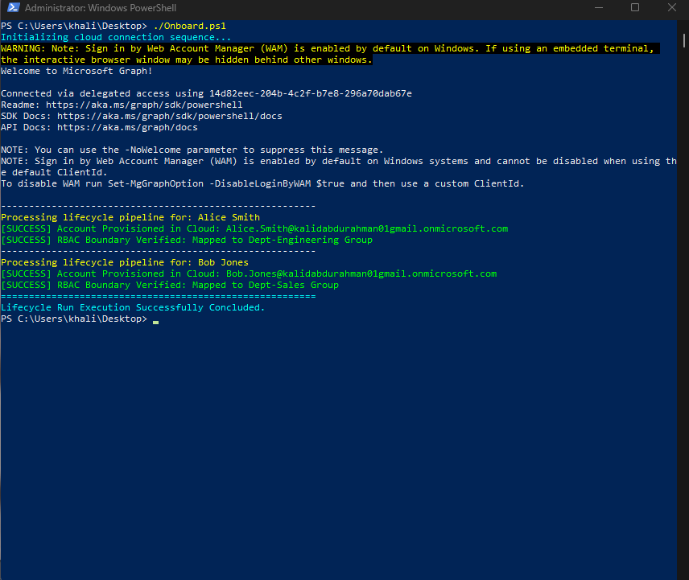
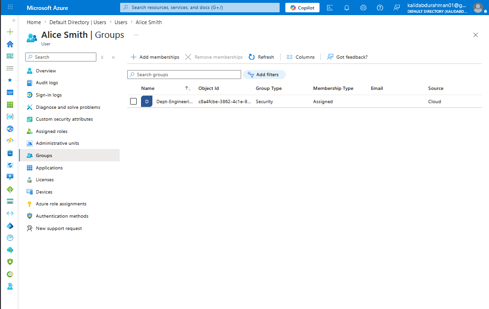
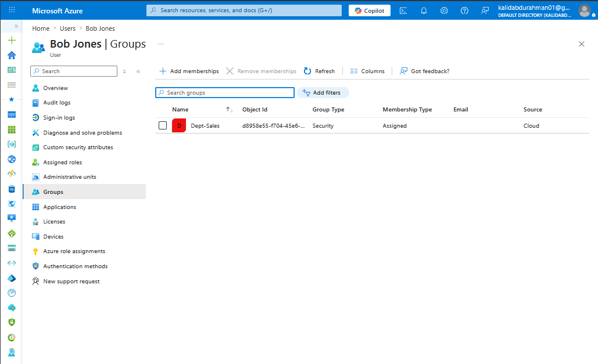

# Azure IAM Lifecycle & Provisioning Automation (Microsoft Graph)

## Business Objective
Manual onboarding of enterprise user accounts creates operational bottlenecks and exposes environments to significant security gaps, including human input error, inconsistent attribute assignments, and "access creep." This engineering project resolves those core business risks by building an automated Identity & Access Management (IAM) lifecycle management pipeline using PowerShell and the modern Microsoft Graph API platform. 

The pipeline ingests raw identity assets, parses account attributes, handles user provisioning schemas within Microsoft Entra ID, and programmatically enforces Role-Based Access Control (RBAC) alignment to guarantee Least-Privilege operational isolation.

---

## Technologies & Tools Used
* **Identity Platform:** Microsoft Entra ID (Cloud Tenant Infrastructure)
* **Automation Framework:** PowerShell Scripting Core
* **API Ingestion Platform:** Microsoft Graph SDK Module Engine
* **Access Control Management:** Role-Based Access Control (RBAC) Boundaries

---

## Automation Architecture Process Workflow
[HR Authorized Roster Export: CSV Asset]
│
▼ (Parsed via PowerShell Data Loop)
[Cryptographic Microsoft Graph Session Token Tunnel]
│
▼ (Automated User Identity Mapping)
[Microsoft Entra ID Cloud Directory Object Created]
│
▼ (Contextual Logic Filter Analysis)
─────── If Department Equals "Engineering" ───────> [Mapped to Dept-Engineering Group Container]
─────── If Department Equals "Sales" ─────────────> [Mapped to Dept-Sales Group Container]

---

## Script Engineering Logic Breakdown
The script addresses identity state lifecycle mechanics via four distinct programmatic stages:
1. **Secure API Authentication:** Initiates a specific cryptographic permission session context (`User.ReadWrite.All` and `GroupMember.ReadWrite.All`) to interface securely against the Microsoft Graph REST API endpoints.
2. **HR Schema Translation:** Imports and loops through structural variable keys (`FirstName`, `LastName`, `Department`, `JobTitle`) dynamically mapping account arrays.
3. **Identity Hardening:** Auto-generates uniform User Principal Names (UPN) and injects strict security compliance postures, forcing a mandatory user password change at the initial authentication layer.
4. **Automated RBAC Enforcement:** Parses structural strings via logical conditional switches, instantly sorting users into dedicated directory security groups to mitigate unauthorized access inheritance.

---

## 👥 Identity Governance Automation Verification

  ### PowerShell Orchestration & Script Execution Terminal Log
  
  
  ### Entra ID Group Policy & Access Validation Enforcements
  
  
